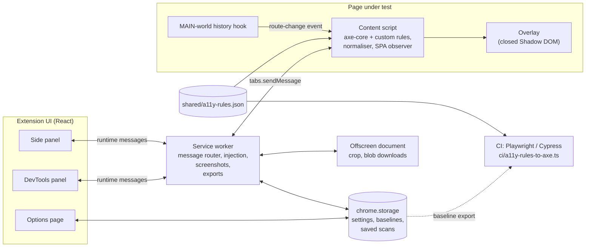

# PalTech A11y Inspector

A Chrome / Edge (Manifest V3) extension that scans the page you are looking at
against **WCAG 2.2 Level A / AA** (AAA optional), highlights every failing
element directly on the page, explains how to fix it, and exports findings as
reports. Only **definite** failures are reported: findings the
checks cannot decide automatically (axe "incomplete" results, text over a
gradient, uncertain focus indicators…) are dropped rather than shown for
review. Checks that need human judgement (alt text quality, heading structure,
dialog behaviour…) still need manual testing; the **Keyboard test** covers
keyboard access.

The engine is [axe-core](https://github.com/dequelabs/axe-core) plus a set of
custom rules (alpha-blended contrast, focus visibility, focus obscured, alt
quality, vague link text, target spacing, form grouping, keyboard reachability,
reflow). The same rule catalogue (`shared/a11y-rules.json`) drives
the extension and your Playwright / Cypress CI checks, and baselines exported
from the extension keep CI failing only on *new* issues.

Highlights:

- Score card, severity summary, "Not conformant" label for Critical WCAG failures
- On-page overlay: numbered issue badges, tab-order path, heading map, landmarks,
  accessible-name tooltips, colour-blindness simulation
- Keyboard test: records where focus goes while you press Tab through the page
  and detects keyboard traps and unreachable controls
- SPA support: rescans (or prompts) on `pushState` route changes, dialog
  opening, and large DOM changes
- Evidence screenshots per issue with redaction; HTML and JSON export. The
  HTML report has two parts. Part 1 is a plain-language summary for team
  leads and clients: verdict, score, severity donut, the problems to fix
  first, who is affected, what was tested and the limits of automated
  testing. Part 2 is for developers: every affected element with its own
  measurements (colour previews with a suggested passing colour), fix,
  selector, HTML and screenshot; XPath and fingerprint are under "Technical
  details". "HTML report with screenshots" captures the first element of each
  failed rule before exporting. The organisation and "Prepared by" shown on
  the report are set in Options
- Baseline and ignore lists per origin, with reasons and authors

axe DevTools-style workflow:

- **Scan part of page**: scope a scan to a CSS selector, pick an element on the
  page (hover + click, arrow keys for parent/child, Esc cancels), or in
  DevTools scan the element selected in the Elements panel (`$0`)
- **WCAG version** picker (2.0 / 2.1 / 2.2) next to the level; findings for
  criteria outside the chosen version are dropped
- **axe-core only** switch (header and Options → General): skips the
  extension's own rules and lets axe's own
  `color-contrast` / `target-size` run, so counts line up with axe DevTools at
  the same WCAG version and level
- **Result tabs**: All / WCAG issues / Best practices / Passed,
  free-text search, a **Status** filter (Open / Ignored / Baselined, with
  "Open only" and "Excluded only" shortcuts) to review ignored or baselined
  issues across all rules, results **grouped by rule** ("Text contrast (12)") with a
  "3 of 12 ◀ ▶" instance stepper and auto-highlight on the page
- **Saved scans**: name and save results, reopen them read-only, export,
  rename, delete, and compare two scans (or one with the current scan) as
  new / fixed / unchanged
- **Copy issue** as plain text; two-pane list + detail layout when the panel is
  wide (typical in DevTools)

## Install

Requirements: Node 20+ and a Chromium browser (Chrome 116+ or Edge).

```bash
npm install
npm run build          # type-checks, then builds to dist/
```

Load the unpacked extension:

1. Open `chrome://extensions` (or `edge://extensions`).
2. Turn on **Developer mode**.
3. Click **Load unpacked** and pick the `dist/` folder.
4. Pin the extension and click its icon on any page to open the side panel.
   A DevTools panel named **PalTech A11y Inspector** is available too.

## Development

```bash
npm run dev            # Vite + CRXJS with hot reload; load dist/ once, then keep editing
npm run typecheck      # tsc --noEmit
npm test               # unit tests (Vitest, jsdom)
npm run test:watch
npm run build && npm run test:e2e   # Playwright end-to-end suite against the built extension
```

To look at the panel UI in a normal tab (demos, screenshots), open
`chrome-extension://<id>/src/sidepanel/index.html?tabId=<N>`; the panel then
stays bound to tab `N`.

Path aliases: `@shared/*` -> `shared/*`, `@src/*` -> `src/*`. All code is
TypeScript (strict). `MODULE_API.md` is the binding contract between modules.

### Fixture pages

`fixtures/*.html` are realistic pages with deliberately planted violations. Each
page embeds a hidden manifest of the definite (Auto) findings the extension must
report, keyed by project rule id:

```html
<script type="application/json" id="expected">
  { "IMG-01": 2, "IMG-02": 2, "IMG-03": 2, "IMG-05": 1, "IMG-06": 2 }
</script>
```

Some pages carry extra manifests: `#expected-best-practice` (findings that only
appear when best practices are enabled), `#expected-keyboard`
(`keyboard-trap.html`, outcome of the Tab-simulation test) and
`#expected-after-change` (`spa.html`, findings that appear after a route change
or dialog).

| Fixture | Plants |
|---|---|
| `images.html` | missing / filename / generic alt, unnamed `svg[role=img]`, `input[type=image]` and `<area>` without alt, bare inline SVG |
| `forms.html` | unlabelled input and select, title-only label, ungrouped radios and checkboxes, visually-required fields without `required`, invalid `autocomplete`, unlinked error text |
| `keyboard-trap.html` | a **real JS keyboard trap** (Tab is intercepted and cycled, no Escape), a legitimate modal that closes on Escape, buttons without a focus indicator, `onclick` on non-focusable elements, nested interactive controls, a link hidden under a fixed header |
| `contrast.html` | text at 4.48:1 / 3.45:1 / 2.85:1, large text below 3:1, faint input borders, a 1.2:1 focus ring, text over a gradient, colour-only link |
| `structure.html` | empty title, invalid `lang`, zoom-disabling viewport, broken `headers` attribute, duplicate ARIA-referenced id, untitled iframe, invalid list structure, `<marquee>` |
| `aria.html` | invalid roles, missing required attributes, misspelled `aria-*`, invalid values, `aria-hidden` on focusables, orphan list items, unnamed progressbar / meter / dialog, status message without a live region |
| `links.html` | empty link and button names, "click here" / "read more" / "here", unannounced `target=_blank`, 16x16 touching targets |
| `spa.html` | `history.pushState` navigation between views, a modal dialog, view-specific violations |

Serve them locally (no build step, no dependencies) and scan them with the
extension:

```bash
node scripts/serve-fixtures.mjs        # http://127.0.0.1:4173/  (PORT=... or --port N to change)
```

`node scripts/print-rules.mjs` prints the rule catalogue below from
`shared/a11y-rules.json` (`--flat`, `--json` variants).

### Unit tests

`vitest.config.ts` runs `tests/unit/**/*.test.ts` in jsdom with the path
aliases. Covered: `shared/color.ts` (parsing, luminance, contrast such as
`#777777` on white = 4.48 and `#767676` = 4.54, alpha blending, passing-colour
suggestion, large-text boundaries), `shared/scoring.ts` (score formula,
best-practice weighting, `isNotConformant`),
`src/content/fingerprint.ts`, `src/content/dom-utils.ts` (unique selectors,
XPath, accessible-name precedence, focusable ordering), the HTML and JSON
exporters, and the `alt-quality` / `link-text` custom rules run against jsdom
documents with a minimal `RuleContext`.

```bash
npm test
```

### End-to-end tests

`tests/e2e/extension.spec.ts` (Playwright, `playwright.config.ts` project
`extension`):

1. copies `dist/` to a temp folder and adds `host_permissions` for
   `127.0.0.1` (Playwright cannot click the toolbar action, which is what
   normally grants `activeTab`);
2. launches Chromium with `--load-extension` in a persistent context and waits
   for the service worker;
3. serves `fixtures/` from an in-test `node:http` server on a random port;
4. opens the side panel page in a tab and, for every fixture, sends
   `SCAN_START` through `chrome.runtime.sendMessage`, polls `GET_LAST_RESULT`,
   and asserts that the count of definite findings per rule id is at least the
   fixture's manifest;
5. checks that scanning leaves the page unmodified (DOM, scroll, focus,
   injected styles) and that `spa.html` route changes and dialogs produce
   `PAGE_CHANGED` events and a rescan finds the view-specific issues.

The suite skips itself when `dist/` is missing. Run headed with
`A11Y_E2E_HEADED=1`; point at another build with `A11Y_E2E_DIST=path`.

```bash
npm run build
npm run test:e2e -- --project extension
```

Playwright's default headless shell cannot load extensions; the test uses the
`chromium` channel (full Chromium, headless) and falls back to a headed
window. If you see "chromium distribution not found", run
`npx playwright install chromium`.

### Monkey test

`tests/monkey/monkey.spec.ts` drives a page with seeded random user actions while the built extension is
loaded, then reports keyboard problems, page errors and accessibility issues that appeared during the run.

```bash
npm run build
npm run test:monkey -- --url keyboard-trap --seed 42     # example: finds the planted trap in fixtures/keyboard-trap.html
npm run test:monkey -- --url https://staging.example.com/checkout --url https://staging.example.com/profile
```

| Option | Default | Meaning |
|---|---|---|
| `--url <page>` | `keyboard-trap` | Page to test, repeatable. A full http(s) URL, or a fixture name. **Only listed pages are visited.** |
| `--seed <n>` | random (printed) | Same seed + same page = same action sequence |
| `--max-actions <n>` | 200 | Action limit |
| `--max-time <s>` | 120 | Time limit for the action loop (the final scan and Tab sweep still run) |
| `--scan-every <n>` | 50 | Extension scan every n actions (plus at start and end) |
| `--sweep-every <n>` / `--sweep-tabs <n>` | 50 / 40 | Tab sweep for the trap check: how often, and how many Tab presses |
| `--delay <ms>` | 50 | Pause after each action |
| `--out <file>` | `test-results/monkey/monkey-<host>-<page>-seed<n>.json` | JSON report path |
| `--headed` | | Show the browser |

**Actions:** click a random visible interactive element, type random text, Tab / Shift+Tab / Enter / Space / Escape /
arrow keys, scroll, hover, and resize the viewport (320, 360, 375, 768, 1024, 1280, 1920 px wide). All input is real
Playwright input, and all randomness comes from the seed.

**Safety:** only the listed URLs are visited; main-frame navigation to another origin is aborted and popups are closed;
form submissions (submit events, `form.submit()`, non-GET navigations) are blocked and submit buttons are not clicked;
`alert`/`confirm` dialogs are dismissed; elements whose text or attributes match delete, remove account, logout,
sign out, pay, payment, buy, purchase or checkout are never clicked, and Enter/Space is not sent while one has focus.
Blocked navigations and submits are listed in the report.

**Checks**

1. *Keyboard.* Focus dropping to `<body>` after a key press (except leaving the document by Tabbing off the last or
   first element); a **focus trap** (the last 20 Tab presses of a 40-press sweep visit at most 5 distinct elements while
   more tabbable elements exist; Escape is then tried, and a lock that Escape releases is reported as a dismissible
   dialog, not a trap); a focused element that is hidden, zero-size, outside the viewport or covered by another element
   (judged after keyboard actions only). Sweeps start from the top of the page at the start, every `--sweep-every`
   actions and at the end.
2. *Page errors.* Uncaught exceptions and unhandled rejections, `console.error`, failed requests and HTTP 4xx/5xx
   responses (favicon excluded).
3. *Accessibility.* The first extension scan of each page is that page's baseline; later scans (every `--scan-every`
   actions and at the end) report issues whose fingerprint was not in it, grouped by rule id and severity.

**Output.** A JSON file (seed, every action taken, new issues with selector and rule id, errors, traps, focus findings,
blocked navigations, verdict) and a readable summary in the terminal. **Exit code 1** if there is a new Critical or
Serious issue, a keyboard trap or an uncaught error; console errors and failed requests are reported but do not fail
the run. Replay a run with the `--url` and `--seed` printed at the top of its output; the run is deterministic as long as
the page itself is (timers, server data and animations can change what is on screen).

The spec skips itself unless started through `npm run test:monkey`, so `npm run test:e2e` is unaffected.

## Permissions

| Permission | Why |
|---|---|
| `activeTab` | Access the current tab only when you invoke the extension (toolbar click, side panel) |
| Host permission `<all_urls>` | Scan any page and its cross-origin iframes, rescan after navigation, and take evidence screenshots: Chrome's `captureVisibleTab` only works with `<all_urls>` (or a fresh toolbar click), so without it screenshots fail when the extension is opened from DevTools or after the page navigates |
| `scripting` | Inject the content script (axe-core + custom rules + overlay) on demand, into all frames the browser lets us reach |
| `sidePanel` | The side panel UI |
| `storage` | Settings, rule configuration, baselines / ignore lists, saved scans (`chrome.storage.local`); the current result per tab lives in `chrome.storage.session` and is cleared when the browser closes |
| `unlimitedStorage` | Saved scans keep full results including evidence screenshots, which quickly exceed the default 10 MB `chrome.storage.local` quota (up to 100 saved scans are kept) |
| `downloads` | Save exported HTML and JSON reports |
| `offscreen` | Crop evidence screenshots and build large report downloads: the MV3 service worker has no DOM canvas and no `URL.createObjectURL` |

The extension asks for no optional permissions.

## Privacy

- Scanning runs entirely inside your browser. No page content, screenshots, or
  results leave the machine unless **you** export a report. The extension makes
  no network requests of its own.
- Screenshots are taken only on explicit action. Input values are masked and
  elements matching your redaction selectors (default `[type=password]`, `.pii`)
  are blurred before an image is stored.
- The overlay lives in a closed Shadow DOM, is excluded from scans, and every
  rule restores focus, scroll position and injected styles it touched.
- No remote code: axe-core and all rules are bundled, as Manifest V3 requires.

## Baselines and CI parity

**Baselines.** Every issue gets a stable 8-hex fingerprint of
`ruleId + selector + text snippet`. From the issue detail you can *Add to
baseline* (known / accepted issue) or *Ignore* (false positive), each with a
reason. Entries are stored per origin, hidden from the list and excluded from
the score by default.
The Options page lists and removes entries and exports a JSON file containing
the baseline, ignore list and rule configuration.

**CI parity.** `ci/a11y-rules-to-axe.ts` turns `shared/a11y-rules.json` plus
your rule configuration and WCAG level into axe options (`{ runOnly, rules }`)
that select exactly the axe rules the extension runs, for `@axe-core/playwright`,
`cypress-axe`, or a plain `axe.run`. `ci/example.spec.ts` is a Playwright test
that:

1. loads the rule catalogue and the baseline export,
2. runs axe in the page with the derived options,
3. computes the same selector / snippet / fingerprint as the extension for each
   violation (importing the extension's own `fingerprint()`), and
4. fails only on violations whose fingerprint (or `ruleId + selector`) is not in
   the baseline, printing the custom rules that axe alone cannot cover.

```bash
A11Y_URL=https://staging.example.com/pricing A11Y_BASELINE=./a11y-baseline.json \
  npx playwright test --project ci-parity
```

Copy `ci/`, `shared/` and `src/content/fingerprint.ts` into your pipeline repo
(or reference this repo as a workspace). The `@shared/*` / `@src/*` aliases are
resolved from `tsconfig.json`.

## Score and conformance

The score uses the same method as Google Lighthouse's accessibility score: a
weighted pass rate over the rules that applied to the page.

```
score = round(100 x weight of passed rules / weight of all applicable rules)
weights: Critical 10, Serious 7, Moderate 3, Minor 1 (best practices count as Minor)
```

- A rule **fails** when it has at least one open finding and is weighted by its
  most severe one; how many elements fail does not change the score.
- A rule **passes** when axe-core reports it as passed; it is weighted by its
  axe impact.
- Not-applicable rules, and rules whose findings are all baselined or ignored,
  are left out. A page where no rule applies scores 100.
- Bands: 90–100 Good, 50–89 Needs improvement, 0–49 Poor.

Best-practice findings never trigger the **Not conformant** label, which appears whenever an
active Critical WCAG issue exists regardless of score. The score is a trend
indicator, not a compliance certification; manual and keyboard testing are part
of any sign-off.

## Architecture



Message flow for a scan: side panel `SCAN_START` -> service worker (loads
settings, rule config, baseline; injects the content script if needed) ->
content script runs axe and the custom rules per frame -> service worker merges
frames, fingerprints and baselines issues, stores the result ->
broadcasts `SCAN_RESULT` -> side panel renders; the overlay draws badges.

## Rule catalogue

Generated from `shared/a11y-rules.json` v1.0.0 (WCAG 2.2) with
`node scripts/print-rules.mjs`: 56 reported rules (43 backed by axe-core, 13
custom).

#### Images and Media

| Rule | Check | WCAG 2.2 | Type | Severity | Source | Enabled by default |
|---|---|---|---|---|---|---|
| IMG-01 | &lt;img&gt; missing alt attribute | 1.1.1 Non-text Content (A) | Auto | Critical | axe: `image-alt` | yes |
| IMG-02 | Alt text is a filename | 1.1.1 Non-text Content (A) | Auto | Serious | custom | yes |
| IMG-03 | Alt text is generic ("image", "photo", "icon") | 1.1.1 Non-text Content (A) | Auto | Moderate | custom | yes |
| IMG-05 | &lt;svg role="img"&gt; with no &lt;title&gt;, aria-label, or aria-labelledby | 1.1.1 Non-text Content (A) | Auto | Serious | axe: `svg-img-alt`, `role-img-alt` | yes |
| IMG-06 | &lt;input type="image"&gt;, &lt;area&gt;, or &lt;object&gt; without text alternative | 1.1.1 Non-text Content (A) | Auto | Critical | axe: `input-image-alt`, `area-alt`, `object-alt`, `server-side-image-map` | yes |

#### Best Practice

| Rule | Check | WCAG 2.2 | Type | Severity | Source | Enabled by default |
|---|---|---|---|---|---|---|
| IMG-04 | Alt text starts with "image of" / "picture of" | Best practice | Auto | Minor | axe: `image-redundant-alt` | yes |
| CLR-08 | Text contrast below 7:1 (enhanced) | 1.4.6 Contrast (Enhanced) (AAA) | Auto | Minor | axe: `color-contrast-enhanced` | no |
| FRM-10 | Form field has multiple labels | Best practice | Auto | Minor | axe: `form-field-multiple-labels` | yes |
| KBD-03 | Positive tabindex value used | 2.4.3 Focus Order (A) | Auto | Serious | axe: `tabindex` | yes |
| KBD-11 | Duplicate accesskey values | Best practice | Auto | Minor | axe: `accesskeys` | yes |
| STR-03 | No &lt;h1&gt; on the page | Best practice | Auto | Moderate | axe: `page-has-heading-one` | yes |
| STR-04 | Heading levels skipped | Best practice | Auto | Moderate | axe: `heading-order` | yes |
| STR-05 | Missing or duplicate &lt;main&gt; landmark | Best practice | Auto | Moderate | axe: `landmark-one-main`, `landmark-no-duplicate-main` | yes |
| STR-06 | Content outside landmarks or landmark misuse | Best practice | Auto | Minor | axe: `region`, `landmark-no-duplicate-banner`, `landmark-no-duplicate-contentinfo`, `landmark-banner-is-top-level`, `landmark-contentinfo-is-top-level`, `landmark-main-is-top-level`, `landmark-complementary-is-top-level`, `landmark-unique` | yes |
| STR-12 | Empty heading or paragraph styled as heading | Best practice | Auto | Minor | axe: `empty-heading`, `p-as-heading` | yes |
| LNK-03 | Vague link text ("click here", "read more") | 2.4.4 Link Purpose (In Context) (A) | Auto | Moderate | custom | yes |
| LNK-04 | Same link text, different destinations | 2.4.4 Link Purpose (In Context) (A) | Auto | Moderate | axe: `identical-links-same-purpose` | yes |
| LNK-05 | Link opens new window without warning | 3.2.5 Change on Request (AAA) | Auto | Minor | custom | yes |

#### Color and Contrast

| Rule | Check | WCAG 2.2 | Type | Severity | Source | Enabled by default |
|---|---|---|---|---|---|---|
| CLR-01 | Normal text contrast below 4.5:1 | 1.4.3 Contrast (Minimum) (AA) | Auto | Serious | axe: `color-contrast` | yes |
| CLR-02 | Large text (24px, or 18.66px bold) contrast below 3:1 | 1.4.3 Contrast (Minimum) (AA) | Auto | Serious | custom | yes |
| CLR-04 | UI component borders/icons below 3:1 | 1.4.11 Non-text Contrast (AA) | Auto | Serious | custom | yes |
| CLR-05 | Focus indicator below 3:1 against adjacent colors | 1.4.11 Non-text Contrast (AA) | Auto | Serious | custom | yes |

#### Forms

| Rule | Check | WCAG 2.2 | Type | Severity | Source | Enabled by default |
|---|---|---|---|---|---|---|
| FRM-01 | Input has no accessible label | 4.1.2 Name, Role, Value (A) | Auto | Critical | axe: `label`, `select-name`, `aria-input-field-name`, `aria-toggle-field-name` | yes |
| FRM-02 | Placeholder or title is the only label | 3.3.2 Labels or Instructions (A) | Auto | Serious | axe: `label-title-only` | yes |
| FRM-03 | Radio/checkbox group with no group label (fieldset+legend or role=group + aria-labelledby) | 1.3.1 Info and Relationships (A) | Auto | Moderate | custom | yes |
| FRM-04 | Required field not indicated programmatically | 3.3.2 Labels or Instructions (A) | Auto | Moderate | custom | yes |
| FRM-07 | Personal data fields missing or invalid autocomplete | 1.3.5 Identify Input Purpose (AA) | Auto | Moderate | axe: `autocomplete-valid` | yes |
| FRM-08 | Visible label text not included in accessible name | 2.5.3 Label in Name (A) | Auto | Serious | axe: `label-content-name-mismatch` | yes |

#### Keyboard and Focus

| Rule | Check | WCAG 2.2 | Type | Severity | Source | Enabled by default |
|---|---|---|---|---|---|---|
| KBD-01 | Clickable element not keyboard focusable | 2.1.1 Keyboard (A) | Auto | Critical | axe: `scrollable-region-focusable` | yes |
| KBD-02 | Keyboard trap detected | 2.1.2 No Keyboard Trap (A) | Auto | Critical | custom | yes |
| KBD-05 | No visible focus indicator | 2.4.7 Focus Visible (AA) | Auto | Serious | custom | yes |
| KBD-06 | Focused element obscured by sticky content | 2.4.11 Focus Not Obscured (Minimum) (AA) | Auto | Serious | custom | yes |
| KBD-07 | No bypass mechanism (no skip link, landmarks, or headings) | 2.4.1 Bypass Blocks (A) | Auto | Moderate | axe: `bypass`, `skip-link` | yes |
| KBD-10 | Interactive controls nested inside each other | 4.1.2 Name, Role, Value (A) | Auto | Serious | axe: `nested-interactive` | yes |

#### Page Structure and Semantics

| Rule | Check | WCAG 2.2 | Type | Severity | Source | Enabled by default |
|---|---|---|---|---|---|---|
| STR-01 | Missing or empty &lt;title&gt; | 2.4.2 Page Titled (A) | Auto | Serious | axe: `document-title` | yes |
| STR-02 | &lt;html&gt; missing valid lang | 3.1.1 Language of Page (A) | Auto | Serious | axe: `html-has-lang`, `html-lang-valid`, `html-xml-lang-mismatch` | yes |
| STR-07 | Data table without proper header association (&lt;th&gt;/scope/headers) | 1.3.1 Info and Relationships (A) | Auto | Serious | axe: `td-headers-attr`, `th-has-data-cells`, `table-duplicate-name`, `scope-attr-valid`, `table-fake-caption` | yes |
| STR-08 | Duplicate id referenced by ARIA or &lt;label for&gt; | 4.1.2 Name, Role, Value (A) | Auto | Critical | axe: `duplicate-id-aria` | yes |
| STR-09 | &lt;iframe&gt; missing or duplicate title | 4.1.2 Name, Role, Value (A) | Auto | Serious | axe: `frame-title`, `frame-title-unique` | yes |
| STR-11 | Invalid lang attribute on an element | 3.1.2 Language of Parts (AA) | Auto | Moderate | axe: `valid-lang` | yes |
| STR-14 | List structure invalid (&lt;li&gt; outside &lt;ul&gt;/&lt;ol&gt;, invalid &lt;dl&gt;) | 1.3.1 Info and Relationships (A) | Auto | Serious | axe: `list`, `listitem`, `definition-list`, `dlitem` | yes |

#### ARIA

| Rule | Check | WCAG 2.2 | Type | Severity | Source | Enabled by default |
|---|---|---|---|---|---|---|
| ARIA-01 | Invalid, deprecated, or disallowed role | 4.1.2 Name, Role, Value (A) | Auto | Critical | axe: `aria-roles`, `aria-allowed-role`, `aria-deprecated-role`, `presentation-role-conflict`, `aria-text` | yes |
| ARIA-02 | Required ARIA attribute missing or attribute not allowed | 4.1.2 Name, Role, Value (A) | Auto | Critical | axe: `aria-required-attr`, `aria-valid-attr`, `aria-allowed-attr`, `aria-prohibited-attr`, `aria-conditional-attr`, `aria-braille-equivalent` | yes |
| ARIA-03 | ARIA attribute value invalid or references missing id | 4.1.2 Name, Role, Value (A) | Auto | Serious | axe: `aria-valid-attr-value` | yes |
| ARIA-04 | aria-hidden="true" on focusable element or &lt;body&gt; | 4.1.2 Name, Role, Value (A) | Auto | Serious | axe: `aria-hidden-focus`, `aria-hidden-body` | yes |
| ARIA-05 | Required child/parent role missing | 1.3.1 Info and Relationships (A) | Auto | Serious | axe: `aria-required-children`, `aria-required-parent` | yes |
| ARIA-07 | ARIA widget (dialog, meter, progressbar, tooltip, treeitem) without accessible name | 4.1.2 Name, Role, Value (A) | Auto | Serious | axe: `aria-dialog-name`, `aria-meter-name`, `aria-progressbar-name`, `aria-tooltip-name`, `aria-treeitem-name` | yes |

#### Links, Buttons, and Targets

| Rule | Check | WCAG 2.2 | Type | Severity | Source | Enabled by default |
|---|---|---|---|---|---|---|
| LNK-01 | Link with no accessible name | 2.4.4 Link Purpose (In Context) (A) | Auto | Critical | axe: `link-name` | yes |
| LNK-02 | Button or command with no accessible name | 4.1.2 Name, Role, Value (A) | Auto | Critical | axe: `button-name`, `input-button-name`, `aria-command-name`, `summary-name` | yes |
| TGT-01 | Target smaller than 24x24 CSS px without sufficient spacing | 2.5.8 Target Size (Minimum) (AA) | Auto | Moderate | axe: `target-size` | yes |

#### Responsiveness and Zoom

| Rule | Check | WCAG 2.2 | Type | Severity | Source | Enabled by default |
|---|---|---|---|---|---|---|
| ZM-01 | Viewport meta disables zoom or caps maximum-scale | 1.4.4 Resize Text (AA) | Auto | Critical | axe: `meta-viewport`, `meta-viewport-large` | yes |
| ZM-02 | Horizontal scroll at 320 CSS px width | 1.4.10 Reflow (AA) | Auto | Serious | custom | yes |
| ZM-03 | Content clipped or spacing locked with increased text spacing | 1.4.12 Text Spacing (AA) | Auto | Moderate | axe: `avoid-inline-spacing` | yes |

#### Other

| Rule | Check | WCAG 2.2 | Type | Severity | Source | Enabled by default |
|---|---|---|---|---|---|---|
| OTH-01 | Timed refresh or redirect via &lt;meta http-equiv="refresh"&gt; | 2.2.1 Timing Adjustable (A) | Auto | Serious | axe: `meta-refresh`, `meta-refresh-no-exceptions` | yes |
| OTH-02 | Blinking or scrolling content (&lt;blink&gt;, &lt;marquee&gt;) | 2.2.2 Pause, Stop, Hide (A) | Auto | Serious | axe: `blink`, `marquee` | yes |
| OTH-03 | Orientation locked via CSS | 1.3.4 Orientation (AA) | Auto | Serious | axe: `css-orientation-lock` | yes |

Notes: results axe cannot decide (`aria-hidden-focus`, `duplicate-id-aria`,
`th-has-data-cells`, `color-contrast` over images…) are not requested, and the
catalogue's undeterminable ("Semi") rules (CLR-03, CLR-06, FRM-05, FRM-06,
IMG-08, KBD-04, KBD-08, MED-01, MED-02, STR-13) are kept only as ids and never
reported. `label-content-name-mismatch` is an experimental axe rule and is off
unless enabled explicitly.

## Known limitations

- Automated tools detect roughly 30-40% of WCAG issues; manual review, the
  keyboard test and real screen reader testing (NVDA, JAWS, VoiceOver, TalkBack) remain
  necessary. The score is not a compliance certification.
- The tool cannot judge the quality or accuracy of alt text, labels, or
  instructions; it only catches obvious patterns (filenames, generic words).
- Contrast over images, gradients, and videos is not checked (it cannot be
  decided automatically).
- Content inside cross-origin iframes may not be scanned without additional
  host permissions; such frames are listed as unscanned.
- Canvas-based content (charts, games) cannot be inspected semantically.
- Issues that appear only after specific interactions (hover menus, error
  states, later SPA views) are found only if you trigger those states before
  scanning; the SPA observer prompts for a rescan but cannot drive the UI.
- The keyboard test depends on you pressing Tab; it does not press keys itself.
- `:focus-visible` styling cannot be forced, so focus indicators that only
  appear with `:focus-visible` may be missed.
- The reflow check (ZM-02) only runs when the page is 320 CSS px wide or
  narrower: resize the window (or zoom to 400%) before scanning to include it.
- Chrome's `--load-extension` flag (used by the e2e suite) is supported by
  Chromium builds and Chrome for Testing, not by the branded Chrome 137+.

## Project layout

```
manifest.json                 MV3 manifest (CRXJS builds it)
shared/                       rule catalogue, types, message contract, WCAG map, colour and scoring math
src/background/               service worker, injection, keyboard tester, evidence, exporters
src/content/                  content script, scanner, normaliser, custom rules, overlay, SPA observer
src/sidepanel | devtools | options | offscreen
fixtures/                     test pages with planted violations and expected-result manifests
tests/unit | tests/e2e        Vitest and Playwright suites
ci/                           rule -> axe options converter and a Playwright parity example
scripts/                      serve-fixtures.mjs, print-rules.mjs, make-icons.mjs
```

License: axe-core is MPL-2.0 and bundled unmodified.
